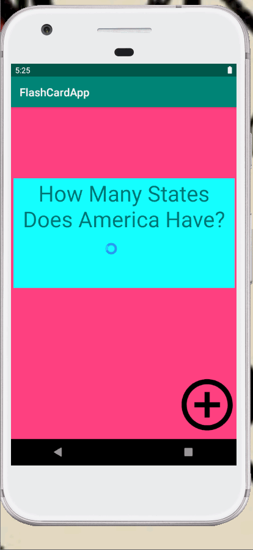

# Flashcard-Lab2
### App Description
Lab two of the flashcard app for codepath
These are the features of the app I have completed
### App Walk-though
 
### Required User Stories
- [X] Start by opening Android Studio and running your app to make sure everything still works as expected
- [X] Add a ‘+’ button that takes the user to new ‘Add Card Screen’
- [X] Add a Cancel button to the 'Add Card Screen'
- [X] Add two fields to the 'Add Card Screen' that will allow the user to enter the Question and the Answer
- [X]  Add a Save button that will dismiss 'Add Card Screen' and return to the Main Activity where the user can see the card they just created
### Optional User Stories
- [] Add an ‘Edit’ button on the Main Activity that will let users ‘Edit’ an existing card
- [] Show an error message to the user if they didn't enter the question or answer
- [] Display a Snackbar notification for when the new card is created successfully
- [] Allow the user to add Multiple Choice answers when creating the card
